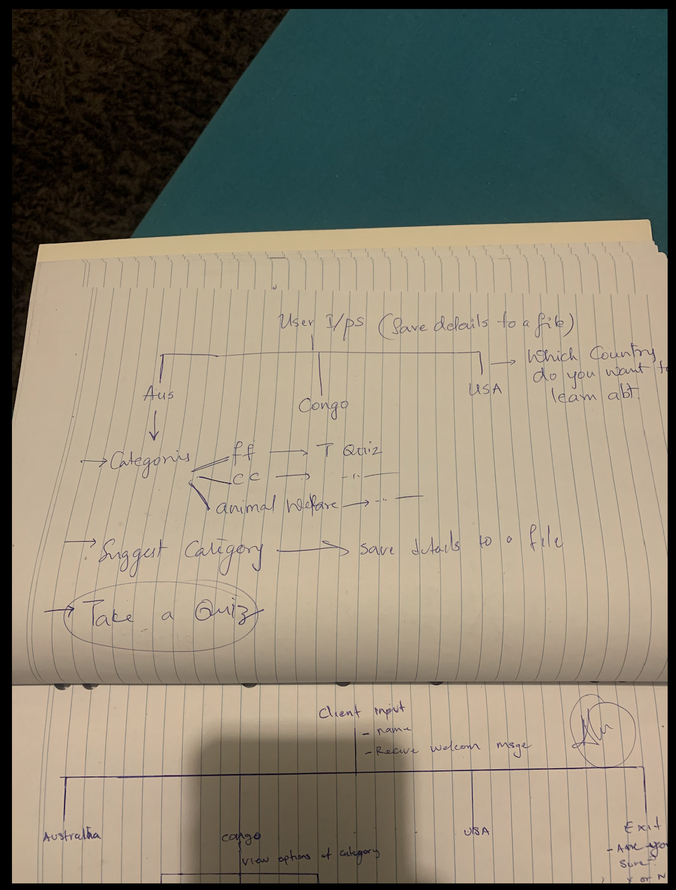
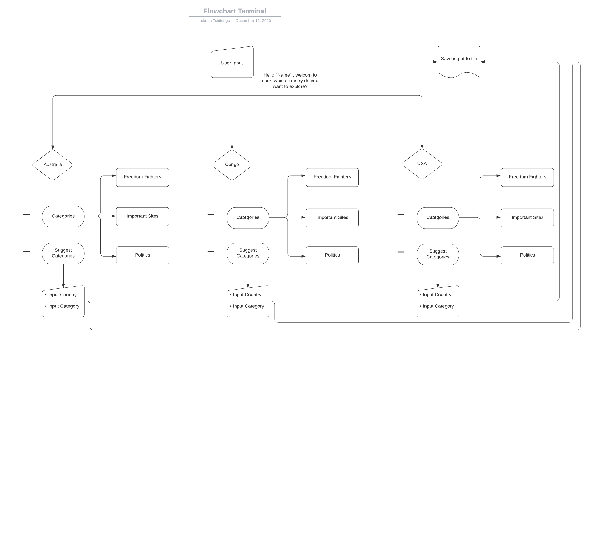
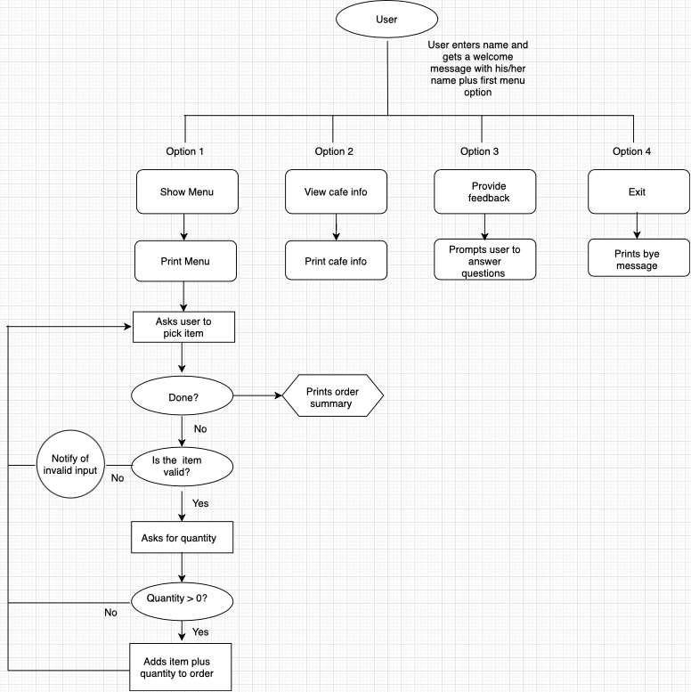
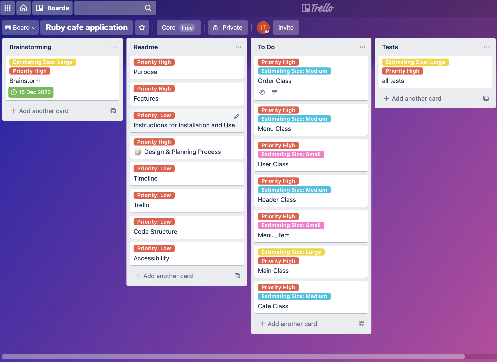
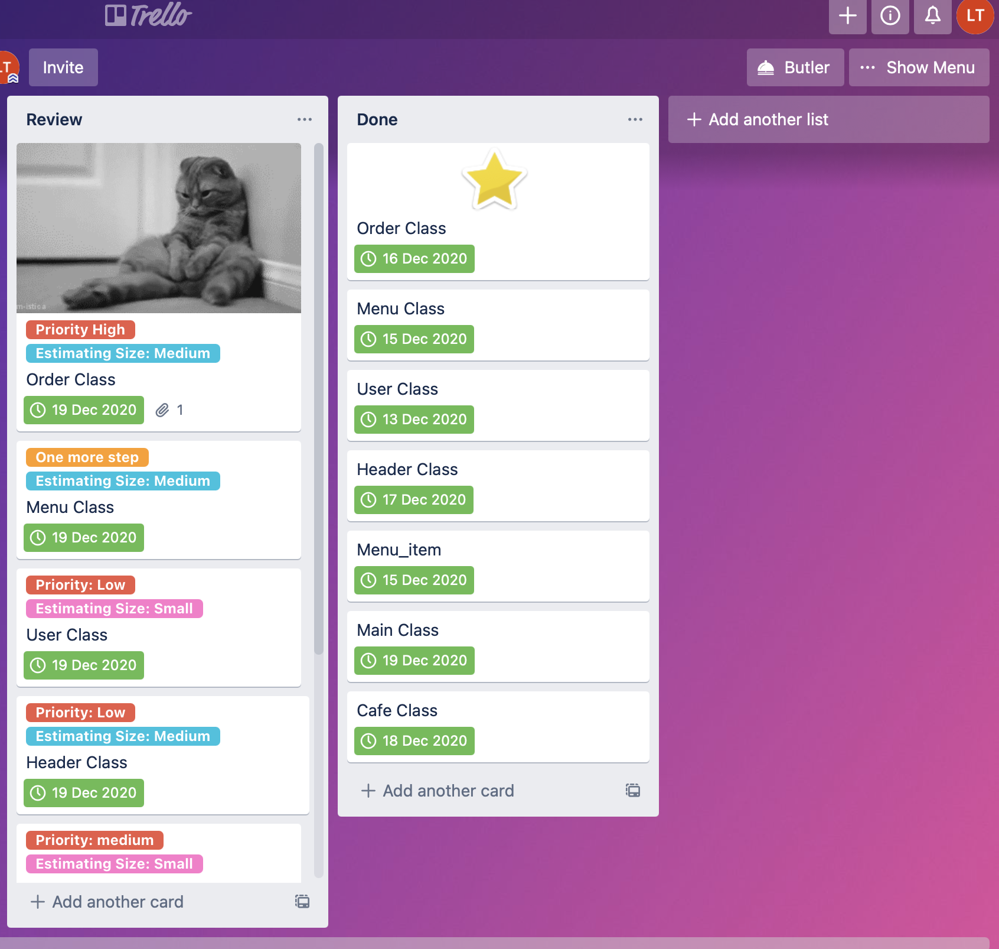

# 🌳 CORE

## Ruby Terminal App

## ℹ️ About the App

### Purpose

It is a cafe application with the purpose of bringing the café experience to the comfort of users’ homes. The application is developed to provide a personalised experience for the users. It allows users to browse through the menu of the café and choose what they would like to eat which will subsequently be delivered to their doorstep. With the pandemic situation growing and the need for a new normalcy to be established, the application is developed to provide small businesses the option to continue operating without having much contact with customers. It provides staff the opportunity to maintain a source of income to meet their everyday needs and enables businesses to have enough revenue to stay afloat. The application is targeted towards almost every member of the public from "early birds" to late ones, coffee loves to people who just enjoy eating out.
The application will be used by customers to browse through a variety of options some of which have been suggested by the application to decide what they would have and then place an order for the food. Through an arrangement between the business and a delivery service, the food will be delivered to the doorstep of the customer which promotes minimal contact with members of the public. The application might be used to order food for friends and family and somewhat maintain the culture of sharing with family and friends.

### Features

#### **Input user info**
On commencing the application, the user is prompted to enter their name, which is followed with a welcome message that includes their name. From there, they are presented with the first menu where they are prompt select between the options. This provides the user with a personalised experience with the aim of providing some semblance of interacting with someone at a café to place an order. 
#### **Show Menu**
This option allows users to browse through the variety of options available to them before concluding on what they would like to order. It also provides the meals in an orderly manner according to the categories of food they fall under. This is important to the users as it makes the use of the application easier and saves time for the users as well.
#### **Provide Feedback**
With this feature, users can provide feedback to the café on areas that they had done an exceptional job on and areas that need to be worked on. It also allows cafes to respond to these feedbacks and welcome further feedback from users. This option is important because with the constant provision of feedback by users, businesses are able to identify what areas they need to work on and try their best to improve which would allow for a better experience for both the users and cafe.
#### **View Cafe Information*
This provides users with general information about the café. 
#### **Allows users to make an order**
This feature makes it possible to users to place orders for what they would like to eat which is the primary purpose of the application being meal service and delivery.

### Instructions for Installation and Use

1. You will need ruby installed on your computer. [Download ruby here](https://www.ruby-lang.org/en/).
2. You will also need the Bundler gem installed. It comes with the main ruby installation, but if you do not have it on your machine, you can install it with the following command:

`gem install bundler`

3. Fork or clone this repository down to your local computer
4. To install the gem(s) required, navigate to the location of the `/src` folder in repostitory on your computer, and use the command:

`bundle install`

5. Run the app with:

`ruby main.rb`

## 📝 Design & Planning Process

When planning for this application, I brainstormed a couple of ideas. I initially thought of doing a educational app that focused on topics that are usually not taught in major educational instituations, but after a few attampts at it, i felt that it was a bit too complicated for my level of knowledge and decided to keep the app simple. As a result, the i settled on a cafe application. 

### Initial Flow Chart

This was our initial flow chart and structure ideas for the educational app idea.

**And this is for the cafe.**

### Timeline

#### Day 1 - 4

Brainstormed app ideas and worked on potential structure and flow of these ideas, before settling on the educational app. 

#### Day 5 - 7

Worked to create the basic structure of the educational app. Utilized a gem TTY-Prompt for the menus so that our user can easily select multiple items at once. 

#### Day 8 - 11

Struggled to make anymore progress with the educational app and decided to abort mission!

#### Day 12 - 14

Had to start from scratch, and been working on the cafe application.

#### Trello

Trello was used to organise, plane and break down what was needed to be done. We had user stories to drive what features we needed to implement. We used custom fields to estimate the sizing (how long a feature would take) as well as the priority of the feature (low, med and high priority).

Below is Trello board on completion of the project.

Day 14
Includes user stories:

### Code Structure

- `main.rb` is the main document that controls the flow of the program.

- `class/Cafe.rb` holds the Hotel class and represents the hotel. This class holds the information of the hotel, such as the address and phone number. It also holds a list of the rooms in the hotel. It is used for methods that show the rooms all together.

- `class/Menu.rb` holds the Room super class, as well as it's sub classes (which represents different types of rooms). This class deals with methods that pertain to a room, such as showing the availability of a room.

- `class/Menu_item.rb` holds the Room super class, as well as it's sub classes (which represents different types of rooms). This class deals with methods that pertain to a room, such as showing the availability of a room.

- `class/User.rb` The cat class represents the customer, and holds the details of the customer as well as the order associated with the customer when it is created. The ordering is initialized with the user as "nil" - this is used during the main flow of the program, as different menus show different things depending on if there is an order or not.

- `class/Order.rb` is initialized once the user has selected an item on the menu. It represents the booking. The methods display the order and it also calculates the total price of the order.

- `class/Headers.rb` is a file that holds some headers to make the main flow of the program look presentable.

### Accessibility

This app allows you to navigate through it using only the keyboard, and the text colour and size has not been manually changed - so the user can set their own peferred colours and font size with their terminal.

The TTY-Prompt gem has makes the app more accessible for a command line interface, as the user doesn't have to type in their desired choice. This also makes it harder for the user to input an incorrect response that may bring up an error.

